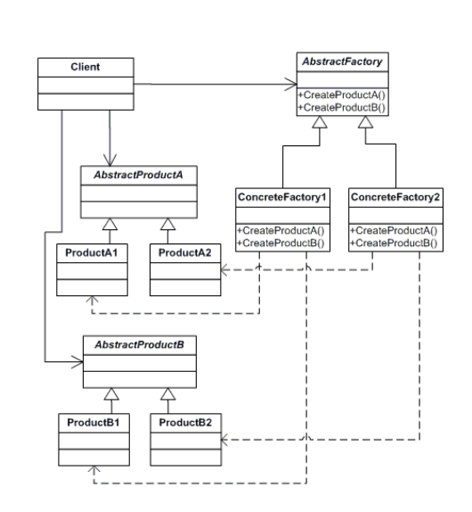
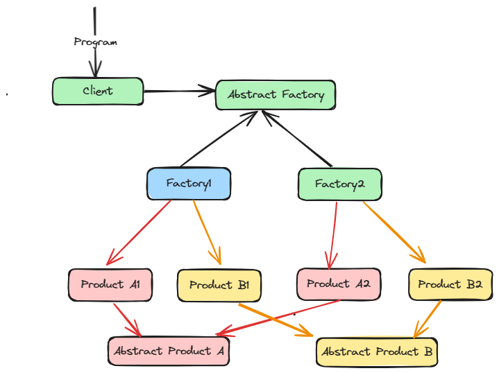

# Abstract Design Pattern

This design pattern provides an interface for creating families of related or dependent objects without specifying their concrete classes.

The classes and objects participating in this pattern include:

* AbstractFactory (VehicleFactory)
   - declares an interface for operations that create abstract products

* ConcreteFactory (ToyotaFactory, HondaFactory)
   - implements the operations to create concrete product objects

* AbstractProduct (Suv, Jeep)
   - declares an interface for a type of product object

* Product (CH-R, Landcruiser, Vezel, CR-V)
   - defines a product object to be created by the corresponding concrete factory
   - implements the AbstractProduct interface

* Client (CarWorld)
   - uses interfaces declared by AbstractFactory and AbstractProduct classes
