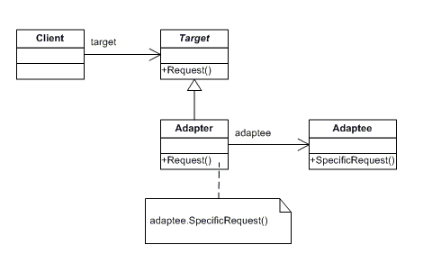
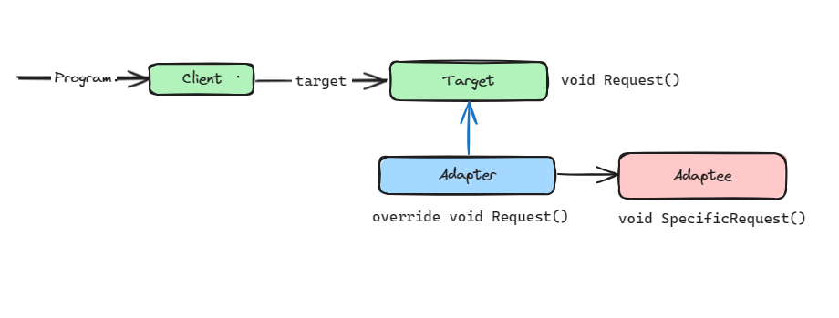

# Adapter Design Pattern

This design pattern converts the interface of a class into another interface clients expect. This design pattern lets classes work together that couldn‘t otherwise because of incompatible interfaces. 

The classes and objects participating in this pattern include:

* Target (ChemicalCompound)
  - defines the domain-specific interface that Client uses.

* Adapter (Compound)
  - adapts the interface Adaptee to the Target interface.

* Adaptee (ChemicalDatabank)
  - defines an existing interface that needs adapting.

* Client (AdapterApp)
  - collaborates with objects conforming to the Target interface.
