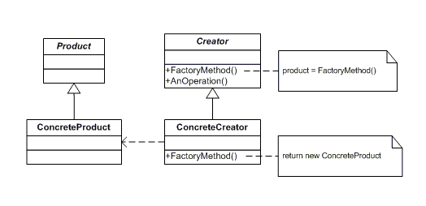

# Factory Method Design Pattern

This design pattern defines an interface for creating an object, but let subclasses decide which class to instantiate. This pattern lets a class defer instantiation to subclasses.

The classes and objects participating in this pattern include:

* AbstractFactory (VehicleFactory)
   - declares an interface for operations that create abstract products

* Product  (Page)
  - defines the interface of objects the factory method creates

* ConcreteProduct  (SkillsPage, EducationPage, ExperiencePage)
  - implements the Product interface

* Creator  (Document)
  - declares the factory method, which returns an object of type Product. Creator may also define a default implementation of the factory method that returns a default ConcreteProduct object.
  - may call the factory method to create a Product object.

* ConcreteCreator  (Report, Resume)
  - overrides the factory method to return an instance of a ConcreteProduct.
