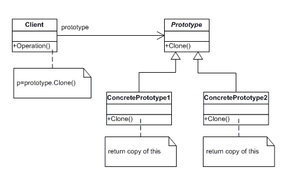
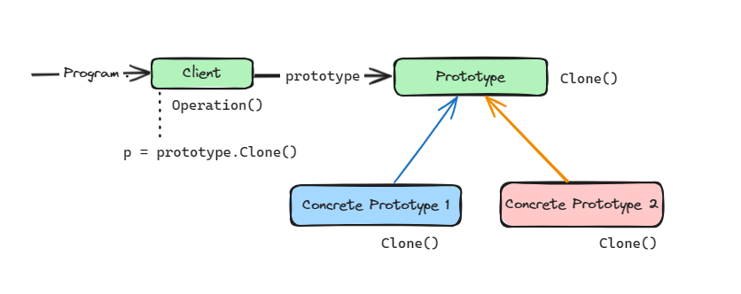

# Prototype Design Pattern

This design pattern specifies the kind of objects to create using a prototypical instance, and create new objects by copying this prototype.

The classes and objects participating in this pattern include:

* Prototype (ColorPrototype)
   - declares an interface for cloning itself

* ConcretePrototype (Color)
   - implements an operation for cloning itself

* Client (ColorManager)
   - creates a new object by asking a prototype to clone itself
