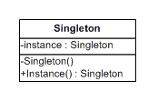
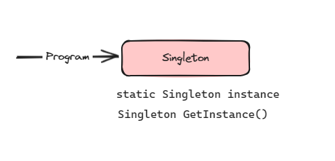

# Singleton Design Pattern

This design pattern ensures a class has only one instance and provide a global point of access to it.

The classes and objects participating in this pattern include:

* Singleton (LoadBalancer)
  - defines an Instance operation that lets clients access its unique instance. Instance is a class operation.
  - responsible for creating and maintaining its own unique instance.
