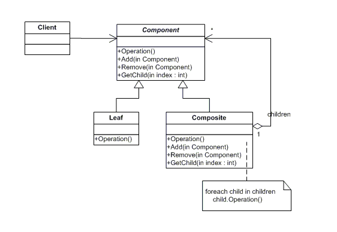
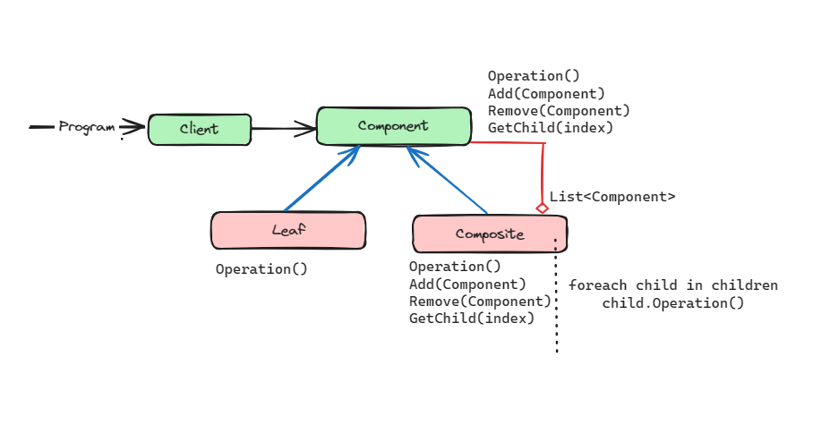

# Composite Design Pattern

This design pattern composes objects into tree structures to represent part-whole hierarchies. This pattern lets clients treat individual objects and compositions of objects uniformly.

The classes and objects participating in this pattern include:

* Component (DrawingElement)
   - declares the interface for objects in the composition.
   - implements default behavior for the interface common to all classes, as appropriate.
   - declares an interface for accessing and managing its child components.
   - (optional) defines an interface for accessing a component's parent in the recursive structure, and implements it if that's appropriate.

* Leaf (PrimitiveElement)
   - represents leaf objects in the composition. A leaf has no children.
   - defines behavior for primitive objects in the composition.

* Composite (CompositeElement)
   - defines behavior for components having children.
   - stores child components.
   - implements child-related operations in the Component interface.

* Client (CompositeApp)
   - manipulates objects in the composition through the Component interface.
